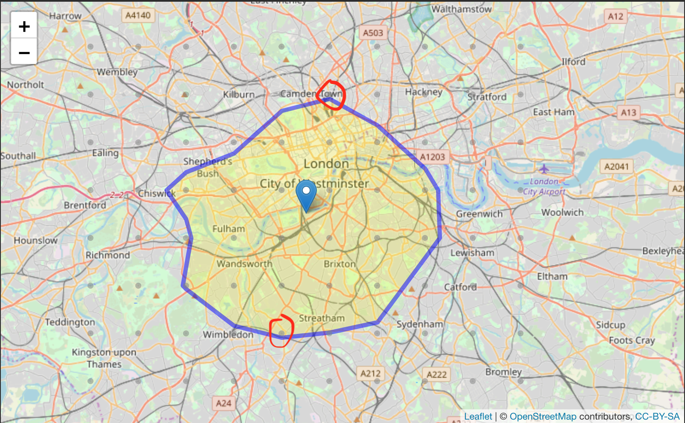
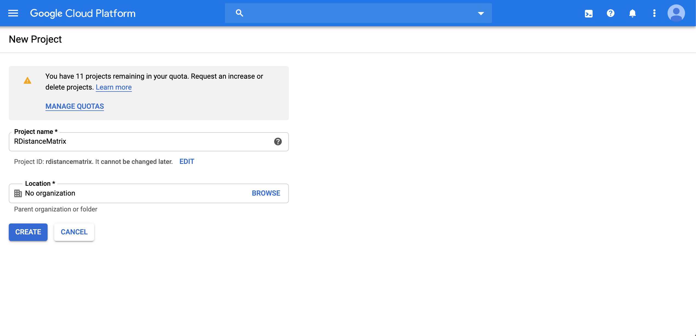
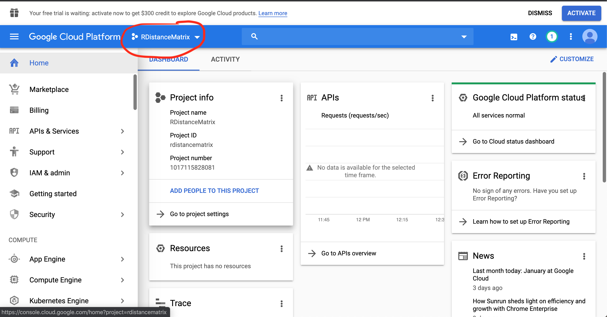

```{r setup, include=FALSE}
knitr::opts_chunk$set(echo = TRUE)
library(tidyverse)
```

## RDistanceMatrix

[](https://opensource.org/licenses/MIT)
[](https://github.com/chrisjb/RDistanceMatrix)
[](https://codecov.io/github/chrisjb/RDistanceMatrix?branch=master)


This package contains functions to geocode locations and generate isochrones/isodistance polygons. 
It also allows for the estimation of population or employment captured within the isochrone.

### Installation:
```{r install, eval = FALSE}
devtools::install_github('chrisjb/RDistanceMatrix')

# for the examples below also install
devtools::install_github('chrisjb/basemapR')
```
### 1. make_isochrone
The isochrone method generates a polygon of the total area to which one can travel from a given origin point. The origin point can be specified as either an address string to be geocoded, or a `data.frame` with a `lat` and `lng` column specifying the coordinates.

### 1.1 mapbox method

To use the mapbox method we need to get ourselves an API key and set it up on R. See section (x.x.x) for how to do this. 
```{r mapbox1, message = FALSE}
library(RDistanceMatrix)
battersea_isochrone <- make_isochrone(site = 'Battersea Power Station', time = 30, method = 'mapbox', mode= 'driving')
```

By plotting our isochrone we can see that the *mapbox* method generates a pretty detailed polygon based on drive time from a given origin. 
```{r mapboxplot1}
library(ggplot2)
library(basemapR)
ggplot() +
  basemapR::base_map(bbox = sf::st_bbox(battersea_isochrone), increase_zoom = 2,basemap = 'google') +
  geom_sf(data = battersea_isochrone, aes(fill = fillColor, color = color, alpha = opacity), show.legend = FALSE) 
```

**When to use method=mapbox:** The mapbox method has the highest level of detail and we can see that it sticks quite rigidly to the road network. This should be used as the default option if we want drive/walking/cycling isochrones from a given origin.

**When not to use method=mapbox:** The mapbox method is less flexible than the alternative of `method=google` but has the benefit of being quick, easy and accurate. It does not support the creation of *transit* isochrones which use the public transport network. It also does not work in the reverse direction (`direction='in'`) so cannot generate an isochrone of origins that can travel *to* the destination site in a given time. Finally, the mapbox method does not support drive times in traffic so the isochrone can be seen as an 'average' drive time.


### 1.2 google method
The google method is more flexible but requires a bit more set up. We have a `multiplier` parameter to tune (see 1.2.1) and we will see that while broadly similar to the mapbox output, it does not have quite the same level of detail in it's ability to follow the road network out to its full extent.

#### 1.2.1 tuning the multiplier parameter
The google method uses the google distance matrix API to calculate the travel time to each of a detailed grid of points. The grid that we set up must be larger than the possible travel time so we consider all possible points. A `multiplier` parameter is used to ensure that the grid is an appropriate size. A multiplier of 1.0 means that we can, on average, travel 1km in 1 minute and so draws a grid of 10km x 10km for a 10 minute isochrone. The true multiplier will vary depending on the geography with central London being much lower, and some areas being higher than this.

To tune the parameter we should use `method=google_guess`. This method uses a very small number of points in a grid to make an initial guess at an isochrone. It returns a `leaflet` map with the grid and isochrone as layers. A correctly tuned `multiplier` parameter should contain the entire isochrone inside of the grid of points, if it doesn't the multiplier should be increased. The isochrone should also reach at least one of the penultimate grid points to ensure we have a detailed enough initial guess.

```{r google1, eval = F}
make_isochrone(site = 'battersea power station', time = 30, method = 'google_guess', mode= 'driving', multiplier = 0.4)
```




#### 1.2.2 Creating an isochrone with google method
Once we have a well calibrated `multiplier` parameter, the algorithm will create a more detailed version of the isochrone by chainging the method to `method='google'`. We have the choice of `high`, `medium` or `low` detail. The former will use more of our API quota and cost us more credits (see information on google api credits below). The default is medium detail which should be sufficient for most purposes.

```{r google2}
battersea_isochrone_google <- make_isochrone(site = 'Battersea Power Station', time = 30, method = 'google', detail = 'med',  mode= 'driving', multiplier = 0.4)
```

If we compare the results of our mapbox isochrone (red) with the google isochrone (blue), we see that the results are broadly similar but the goolgle one is more generalised. The mapbox version does a better job at sticking to the road network and following the roads out as long as to their 30 minute extents. For this reason, we should prefer the mapbox version for tasks that can be accomplished with the mapbox API.

```{r}
library(ggplot2)
library(basemapR)
ggplot() +
  basemapR::base_map(bbox = sf::st_bbox(battersea_isochrone), increase_zoom = 2,basemap = 'google') +
  geom_sf(data = battersea_isochrone, aes(fill = fillColor, color = color, alpha = opacity), show.legend = FALSE) +
  geom_sf(data = battersea_isochrone_google, fill = 'blue', color = 'blue', alpha = 0.3)
```

We can increase the detail of our google isochrone (costing us more credits):

```{r}
battersea_isochrone_google_high <- make_isochrone(site = 'Battersea Power Station', time = 30, method = 'google', detail = 'high',  mode= 'driving', multiplier = 0.4)
```

This gives us a more detailed isochrone, but we also get a few 'islands' and 'holes' where the algorithm found points that could be reached within 30minutes, but where there was a point in between which couldn't (perhaps the point identified was in a park or otherwise off the road network).

```{r}
library(ggplot2)
library(basemapR)
ggplot() +
  basemapR::base_map(bbox = sf::st_bbox(battersea_isochrone), increase_zoom = 2,basemap = 'google') +
  geom_sf(data = battersea_isochrone, aes(fill = fillColor, color = color, alpha = opacity), show.legend = FALSE) +
  geom_sf(data = battersea_isochrone_google_high, fill = 'blue', color = 'blue', alpha = 0.3)
```


#### 1.2.3 Other options with the google method
With the google method we have the ability to reverse the direction (what origins are there that can we leave from and arrive at the site within x minutes?). We can also set the departure time to a peak hour to get the isochrone accounting for traffic, or we can use `mode=transit` to get an isochrone using public transport.

```{r}
battersea_isochrone_google_pt <- make_isochrone(site = 'Battersea Power Station', time = 30, method = 'google', detail = 'high',  mode= 'transit', multiplier = 0.4)
```

With public transport (blue) we can't get as far from Battersea Power station as we could by car (red).
````{r}
ggplot() +
  basemapR::base_map(bbox = sf::st_bbox(battersea_isochrone), increase_zoom = 2,basemap = 'google') +
  geom_sf(data = battersea_isochrone_google, fill = "#bf4040", color = "#bf4040", alpha = .33, show.legend = FALSE) +
  geom_sf(data = battersea_isochrone_google_pt, fill = 'blue', color = 'blue', alpha = 0.33)
```

let's see what happens with traffic. Note that the `departing` parameter must be set to a date and time in the future.
```{r}
battersea_isochrone_google_traffic <- make_isochrone(site = 'Battersea Power Station', time = 30, method = 'google', detail = 'med',  mode= 'driving', multiplier = 0.25,
                                                departing = '2020-03-02 08:00:00')
```

In 8am traffic (blue) we can now only travel a bit further then by public transport (green).
```{r}
ggplot() +
  basemapR::base_map(bbox = sf::st_bbox(battersea_isochrone), increase_zoom = 2,basemap = 'google') +
  geom_sf(data = battersea_isochrone_google, fill = "#bf4040", color = "#bf4040", alpha = .33, show.legend = FALSE) +
  geom_sf(data = battersea_isochrone_google_traffic, fill = 'blue', color = 'blue', alpha = .33) +
  geom_sf(data = battersea_isochrone_google_pt, fill = "green", color = "green", alpha = .33, show.legend = FALSE) 
```


Is it better getting *to* battersea than *from*?

```{r}
battersea_isochrone_google_traffic_inbound <- make_isochrone(site = 'Battersea Power Station', time = 30, direction = 'in', 
                                                        method = 'google', detail = 'med',  mode= 'driving', multiplier = 0.25,
                                                        departing = '2020-03-02 08:00:00')
```

Inbound travel time (green) seems to be broadly similar to outbound time (blue) in this case.

```{r}
ggplot() +
  basemapR::base_map(bbox = sf::st_bbox(battersea_isochrone), increase_zoom = 2,basemap = 'google') +
  geom_sf(data = battersea_isochrone_google_traffic, fill = 'blue', color = 'blue', alpha = .33) +
  geom_sf(data = battersea_isochrone_google_traffic_inbound, fill = "green", color = "green", alpha = .33, show.legend = FALSE)
```


### 2. make_isodistance
Only available with `method=google`. 

Creates a simple features polygon of the area accessible to/from a given location within a certain travel *distance*. Distances available by `driving`, `transit`, `walking` or `cycling`.

As with `make_isochrone`, we can set the detail level `detail = c('high', 'medium', 'low')` to get a more/less accurate isodistance polygon at the expense of more/less google API credits (see below). 

**examples:**
```{r}
walk_radius <- make_isodistance('EC2R 8AH', distance = 2000, direction = 'out', mode = 'walking',)

ggplot() +
  base_map(bbox = st_bbox(walk_radius), increase_zoom = 2,basemap = 'google') +
  geom_sf(data = walk_radius, fill=NA)
```

### 3. get_distance
Uses the google distance matrix API to get the distance or time between a set of origins and destinations. Input is a data.frame with columns for origin and destination.

**Examples:**
Single origin-destination:
```{r}
od1 <- tibble::tibble(
  origin = '51.5131,-0.09182',
  destination = 'EC2R 8AH'
)


get_distance(od1, origin, destination, mode = 'transit')
```

Multiple origin destination:
```{r}
pcd_df <- tibble::tribble(
~ origin,           ~destination,
 "51.5131,-0.09182", 'EC2R 8AH',
 "51.5037,-0.01715", 'E14 5AB',
" 51.5320,-0.12343", 'SE1 9SG',
 "51.4447,-0.33749", 'SW1A 1AA'
 )

get_distance(pcd_df, origin, destination)
```

Example with a dataframe of origins (lat lng) and a single destination;

```{r}
df <- tibble::tribble(
 ~ lat, ~lng,
 51.5131, -0.09182,
 51.5037, -0.01715,
 51.5320, -0.12343,
 51.4447, -0.33749
 )

origin_df <- mutate(df, origin = paste0(lat,',',lng))

get_distance(origin_df, origin, 'London Paddington')
```

### 4. geoCode
`geocode` uses the google geocoding API to geocode an address or set of coordinates.
`geocode_mapbox` uses the mapbox geocoding API to geocode an address or set of coordinates.

Both require an API key to use for the respective APIs. See sections below on getting an API key.

```{r}
library(RDistanceMatrix)
geocode(address = 'Ulverston, Cumbria')
```

By default the API will return multiple potential matches for our site. 
```{r}
geocode_mapbox(address = 'Bath Abbey, Bath, UK', return_all = T)
```
Setting `return_all = F` can be useful when we want only the first identified location returned. The first location tends to be the best guess at the intended address.
```{r}
geocode_mapbox(address = 'Bath Abbey, Bath, UK', return_all = F)
```


We can always explore the locations returned in leaflet
```{r eval =FALSE}
library(leaflet)
bath <- geocode_mapbox(address = 'Bath Abbey, Bath, UK', return_all = T)

leaflet() %>%
  addTiles() %>%
  addAwesomeMarkers(data = bath, lng = ~lng, lat= ~lat, popup = ~type) %>%
  addAwesomeMarkers(data = bath[1,], lng = ~lng, lat= ~lat, popup = 'best_guess', 
                    icon = ~awesomeIcons('star',markerColor = 'red'))
```

### 5. get population and employment within a boundary
#### 5.1 get_population_within
This function aims to estimate the population within an `sf` polygon. It can be used in conjunction with `make_isochrone` or `make_isodistance` which both return `sf` objects.

The function works by intersecting [Lower Layer Super Output Areas](https://en.wikipedia.org/wiki/Lower_Layer_Super_Output_Area) (lsoas) with the input polygon. The population is then fetched from the [NOMIS API](https://www.nomisweb.co.uk/query/select/getdatasetbytheme.asp?) for each LSOA that overlaps with our input polygon.

The dataset returned contains population data for each LSOA within our boundary (`population`), the percentage of the LSOA that lies within our boundary (`overlap`), and the *estimated* population that actually lies within the boundary (`population_within`). The `population_within` column assumes that population is evenly distributed throughout the LSOA so is an **estimate rather than a precise figure**.

```{r}
iso <- make_isochrone(site = 'bath abbey, bath, uk', time = 30, method = 'mapbox', mode = 'driving')
pop_all_ages <- get_population_within(iso, year ='latest',age = 'all')

glimpse(pop_all_ages)
```

We can also split by age group. Options include `working`,`five_year` and `sya` (single year of age).
```{r}
library(dplyr)
pop_working <- get_population_within(iso, year ='latest',age = 'working')

pop_working %>%
  group_by(age) %>%
  summarise(estimated_pop = sum(population_within))
```

#### 5.2 get_employment_within
This function aims to estimate the employment within an `sf` polygon. It can be used in conjunction with `make_isochrone` or `make_isodistance` which both return `sf` objects.

The function works by intersecting [Lower Layer Super Output Areas](https://en.wikipedia.org/wiki/Lower_Layer_Super_Output_Area) (lsoas) with the input polygon. The employment data is then fetched from the [NOMIS API](https://www.nomisweb.co.uk/query/select/getdatasetbytheme.asp?) using the Business Register and Employment Survey dataset.

The dataset returned contains employment data for each LSOA within our boundary (`employment`), the percentage of the LSOA that lies within our boundary (`overlap`), and the *estimated* employment that actually lies within the boundary (`employment_within`). The `employment_within` column assumes that employment is evenly distributed throughout the LSOA so is an **estimate rather than a precise figure**.

```{r}
iso <- make_isochrone(site = 'Barrow-in-Furness, Cumrbia', time = 20, method = 'mapbox', mode = 'driving')
emp_all_ind <- get_employment_within(iso, year ='latest',industry =  'all')

glimpse(emp_all_ind)
```

If we set the `type` option to 'employees' rather than 'employment', we can split by part-time/full-time employees. 
```{r}
library(dplyr)
pt_ft <- get_employment_within(iso, year ='latest',type = 'employees', split = TRUE)

pt_ft %>%
  group_by(employment_status_name) %>%
  summarise(estimated_emp = sum(employment_within)) %>%
  tidyr::pivot_wider(names_from = employment_status_name, values_from = estimated_emp) %>%
  mutate(full_time_equiv = 0.5*`Part-time employees` + `Full-time employees`)
```

We can also get the industry break down of employees in the area. Options include:
* `all` for no industry breakdown
* `broad` for broad groups
* `sections` for sections
* `2digit` for two digit SIC codes

```{r}
library(dplyr)
emp_broad <- get_employment_within(iso, year ='latest',industry = 'broad')

emp_broad %>% 
  group_by(industry_id, industry_name) %>%
  summarise(estimated_emp = sum(employment_within))  
```

### Getting a google API Key
1. [https://accounts.google.com/SignUp?hl=en&continue=https://myaccount.google.com/intro](Create a Google account)
2. Head to the [https://console.cloud.google.com/](google cloud console) and log in
3. Collect free trial credits: At the time of writing google are offering $300 in free credits to use over 12 months. You will have to submit billing info to collect this, but you will need to do this in a later step anyway.


4. Create a project: Select project > New project 



5. Select our new project: Select project > <our project>



6. Go to the API library (APIs and services > Dashboard > Library)


7. Search for GeoCoding API and enable
8. Search for Distance Matrix API and enable
9. **enable billing:** to use the APIs you must enable billing. In the main nav bar on the left navigate to billing and *link billing account*. If you didn't sign up for the free trial in step 3, you will need to create a billing account here.
10. **get your API key:** on the left nav navigate to APIs & Services > Credentials > Create Credentials > API KEY
11. Copy this API key and set it in our RStudio environment using `set_google_api('<your api key>')`

#### If the API key doesn't persist
Setting the API key in this way should mean that the API key is always accessible by the RDistanceMatrix package in every new R session. If the API key cannot be found after closing and opening a new R session, we can set it manually using:

`usethis::edit_r_environ()`

and paste in the line:
google_api_key = '<your key here>'


#### Google API Credits
The [documentation](https://developers.google.com/maps/documentation/distance-matrix/usage-and-billing) explains how requests made to the distance matrix API are priced. At the time of writing you get $200 worth of free API usage each month. This equates to 40,000 **elements** each month using the standard API request, or 20,000 **elements** using the advanced API request (the advanced API is used if we set a departure time for time in traffic).

To avoid going over the monthly limit, pay attention to the messages that are output from the `make_isochrone` and `make_isodistance` functions. The functions will tell you how many API credits we used after each request, and will warn us before making requests worth over $10 in credit. Never reveal your API key to anyone.

**What is an element?** An element is one origin-destination request. A typical isochrone will use anywhere between 100 and 1000 origin-destination queries to determine the extents of the isochrone polygon. 

If you're unsure how much usage you have left for the month, visit the [APIs and services dashboard](https://console.cloud.google.com/apis/dashboard) for your project, click on our API (Distance Matrix API) and you can view how many elements used each day over the past month.


### Getting a mapbox API Key
1. [sign up for mapbox](https://www.mapbox.com/)
2. [Head to your account page](https://account.mapbox.com/)
3. Scroll down to see an option to create an api key 
4. Copy this API key and set it in our RStudio environment using `set_mapbox_api('<your api key>')`

No billing details are required at the time of writing so no need to worry about going over quotas. The free quota is very generous and allows 100,000 isochrones to be made free of charge.

#### If the API key doesn't persist
Setting the API key in this way should mean that the API key is always accessible by the RDistanceMatrix package in every new R session. If the API key cannot be found after closing and opening a new R session, we can set it manually using:

`usethis::edit_r_environ()`

and paste in the line:
mapbox_api_key = '<your key here>'

### Getting a Nomis API Key
1. [Sign up for a NOMIS account](https://www.nomisweb.co.uk/myaccount/userjoin.asp)
2. Once signed in, click on your name to reveal the account menu and click on 'account summary'
3. Scroll down and click 'NOMIS API' in the menu to the left
4. Your 'unique id' should be displayed here. This is your API key.
5. Copy this API key and set it in our RStudio environment using `set_nomis_api('<your api key>')`

#### If the API key doesn't persist
Setting the API key in this way should mean that the API key is always accessible by the RDistanceMatrix package in every new R session. If the API key cannot be found after closing and opening a new R session, we can set it manually using:

`usethis::edit_r_environ()`

and paste in the line:
nomis_api_key = '<your key here>'
