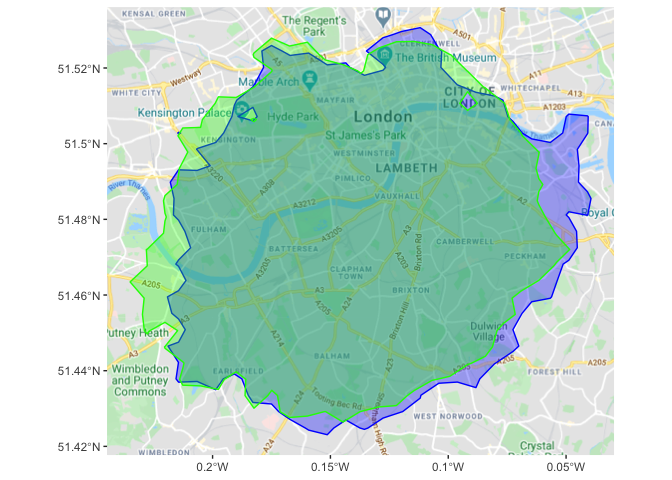

readme
================

## RDistanceMatrix

[](https://opensource.org/licenses/MIT)
[](https://github.com/chrisjb/RDistanceMatrix)
[](https://travis-ci.org/chrisjb/RDistanceMatrix)
[](https://codecov.io/github/chrisjb/RDistanceMatrix?branch=master)

This package contains functions to geocode locations and generate
isochrones/isodistance polygons. It also allows for the estimation of
population or employment captured within the isochrone.

### Installation:

``` r
devtools::install_github('chrisjb/RDistanceMatrix')

# for the examples below also install
devtools::install_github('chrisjb/basemapR')
```

### 1\. make\_isochrone

The isochrone method generates a polygon of the total area to which one
can travel from a given origin point. The origin point can be specified
as either an address string to be geocoded, or a `data.frame` with a
`lat` and `lng` column specifying the coordinates.

### 1.1 mapbox method

To use the mapbox method we need to get ourselves an API key and set it
up on R. See section (6.2) for how to do this.

``` r
library(RDistanceMatrix)
battersea_isochrone <- make_isochrone(site = 'Battersea Power Station', time = 30, method = 'mapbox', mode= 'driving')
```

By plotting our isochrone we can see that the *mapbox* method generates
a pretty detailed polygon based on drive time from a given origin.

``` r
library(ggplot2)
library(basemapR)
ggplot() +
  basemapR::base_map(bbox = sf::st_bbox(battersea_isochrone), increase_zoom = 2,basemap = 'google') +
  geom_sf(data = battersea_isochrone, aes(fill = fillColor, color = color, alpha = opacity), show.legend = FALSE) 
```

    ## please see attribution details: https://wikimediafoundation.org/wiki/Maps_Terms_of_Use

<!-- -->

**When to use method=mapbox:** The mapbox method has the highest level
of detail and we can see that it sticks quite rigidly to the road
network. This should be used as the default option if we want
drive/walking/cycling isochrones from a given origin.

**When not to use method=mapbox:** The mapbox method is less flexible
than the alternative of `method=google` but has the benefit of being
quick, easy and accurate. It does not support the creation of *transit*
isochrones which use the public transport network. It also does not work
in the reverse direction (`direction='in'`) so cannot generate an
isochrone of origins that can travel *to* the destination site in a
given time. Finally, the mapbox method does not support drive times in
traffic so the isochrone can be seen as an ‘average’ drive time.

### 1.2 google method

The google method is more flexible but requires a bit more set up. We
have a `multiplier` parameter to tune (see 1.2.1) and we will see that
while broadly similar to the mapbox output, it does not have quite the
same level of detail in it’s ability to follow the road network out to
its full extent.

#### 1.2.1 tuning the multiplier parameter

The google method uses the google distance matrix API to calculate the
travel time to each of a detailed grid of points. The grid that we set
up must be larger than the possible travel time so we consider all
possible points. A `multiplier` parameter is used to ensure that the
grid is an appropriate size. A multiplier of 1.0 means that we can, on
average, travel 1km in 1 minute and so draws a grid of 10km x 10km for a
10 minute isochrone. The true multiplier will vary depending on the
geography with central London being much lower, and some areas being
higher than this.

To tune the parameter we should use `method=google_guess`. This method
uses a very small number of points in a grid to make an initial guess at
an isochrone. It returns a `leaflet` map with the grid and isochrone as
layers. A correctly tuned `multiplier` parameter should contain the
entire isochrone inside of the grid of points, if it doesn’t the
multiplier should be increased. The isochrone should also reach at least
one of the penultimate grid points to ensure we have a detailed enough
initial
guess.

``` r
make_isochrone(site = 'battersea power station', time = 30, method = 'google_guess', mode= 'driving', multiplier = 0.4)
```


#### 1.2.2 Creating an isochrone with google method

Once we have a well calibrated `multiplier` parameter, the algorithm
will create a more detailed version of the isochrone by chainging the
method to `method='google'`. We have the choice of `high`, `medium` or
`low` detail. The former will use more of our API quota and cost us more
credits (see information on google api credits below). The default is
medium detail which should be sufficient for most
purposes.

``` r
battersea_isochrone_google <- make_isochrone(site = 'Battersea Power Station', time = 30, method = 'google', detail = 'med',  mode= 'driving', multiplier = 0.4)
```

    ## Geocoding: "Battersea Power Station" if you entered precise co-ordinates, please specify site as a data frame containing the columns "lat" and "lng"

    ## drawing initial isochrone...

    ## Linking to GEOS 3.7.2, GDAL 2.4.2, PROJ 5.2.0

    ## adding detail to initial isochrone...

    ## Trying URL: 1 of 4

    ## Trying URL: 2 of 4

    ## Trying URL: 3 of 4

    ## Trying URL: 4 of 4

    ## Google API elements used: 476 (£2.38 credits). Isochrone generated to accuracy of 509m

If we compare the results of our mapbox isochrone (red) with the google
isochrone (blue), we see that the results are broadly similar but the
goolgle one is more generalised. The mapbox version does a better job at
sticking to the road network and following the roads out as long as to
their 30 minute extents. For this reason, we should prefer the mapbox
version for tasks that can be accomplished with the mapbox API.

``` r
library(ggplot2)
library(basemapR)
ggplot() +
  basemapR::base_map(bbox = sf::st_bbox(battersea_isochrone), increase_zoom = 2,basemap = 'google') +
  geom_sf(data = battersea_isochrone, aes(fill = fillColor, color = color, alpha = opacity), show.legend = FALSE) +
  geom_sf(data = battersea_isochrone_google, fill = 'blue', color = 'blue', alpha = 0.3)
```

    ## please see attribution details: https://wikimediafoundation.org/wiki/Maps_Terms_of_Use

<!-- -->

We can increase the detail of our google isochrone (costing us more
credits):

``` r
battersea_isochrone_google_high <- make_isochrone(site = 'Battersea Power Station', time = 30, method = 'google', detail = 'high',  mode= 'driving', multiplier = 0.4)
```

    ## Geocoding: "Battersea Power Station" if you entered precise co-ordinates, please specify site as a data frame containing the columns "lat" and "lng"

    ## drawing initial isochrone...

    ## adding detail to initial isochrone...

    ## Trying URL: 1 of 7

    ## Trying URL: 2 of 7

    ## Trying URL: 3 of 7

    ## Trying URL: 4 of 7

    ## Trying URL: 5 of 7

    ## Trying URL: 6 of 7

    ## Trying URL: 7 of 7

    ## Google API elements used: 784 (£3.92 credits). Isochrone generated to accuracy of 382m

This gives us a more detailed isochrone, but we also get a few ‘islands’
and ‘holes’ where the algorithm found points that could be reached
within 30minutes, but where there was a point in between which couldn’t
(perhaps the point identified was in a park or otherwise off the road
network).

``` r
library(ggplot2)
library(basemapR)
ggplot() +
  basemapR::base_map(bbox = sf::st_bbox(battersea_isochrone), increase_zoom = 2,basemap = 'google') +
  geom_sf(data = battersea_isochrone, aes(fill = fillColor, color = color, alpha = opacity), show.legend = FALSE) +
  geom_sf(data = battersea_isochrone_google_high, fill = 'blue', color = 'blue', alpha = 0.3)
```

    ## please see attribution details: https://wikimediafoundation.org/wiki/Maps_Terms_of_Use

<!-- -->

#### 1.2.3 Other options with the google method

With the google method we have the ability to reverse the direction
(what origins are there that can we leave from and arrive at the site
within x minutes?). We can also set the departure time to a peak hour to
get the isochrone accounting for traffic, or we can use `mode=transit`
to get an isochrone using public
transport.

``` r
battersea_isochrone_google_pt <- make_isochrone(site = 'Battersea Power Station', time = 30, method = 'google', detail = 'high',  mode= 'transit', multiplier = 0.4)
```

    ## Geocoding: "Battersea Power Station" if you entered precise co-ordinates, please specify site as a data frame containing the columns "lat" and "lng"

    ## drawing initial isochrone...

    ## adding detail to initial isochrone...

    ## Trying URL: 1 of 8

    ## Trying URL: 2 of 8

    ## Trying URL: 3 of 8

    ## Trying URL: 4 of 8

    ## Trying URL: 5 of 8

    ## Trying URL: 6 of 8

    ## Trying URL: 7 of 8

    ## Trying URL: 8 of 8

    ## Google API elements used: 807 (£4.035 credits). Isochrone generated to accuracy of 237m

With public transport (blue) we can’t get as far from Battersea Power
station as we could by car (red).

``` r
ggplot() +
  basemapR::base_map(bbox = sf::st_bbox(battersea_isochrone), increase_zoom = 2,basemap = 'google') +
  geom_sf(data = battersea_isochrone_google, fill = "#bf4040", color = "#bf4040", alpha = .33, show.legend = FALSE) +
  geom_sf(data = battersea_isochrone_google_pt, fill = 'blue', color = 'blue', alpha = 0.33)
```

    ## please see attribution details: https://wikimediafoundation.org/wiki/Maps_Terms_of_Use

<!-- -->

let’s see what happens with traffic. Note that the `departing` parameter
must be set to a date and time in the
future.

``` r
battersea_isochrone_google_traffic <- make_isochrone(site = 'Battersea Power Station', time = 30, method = 'google', detail = 'med',  mode= 'driving', multiplier = 0.25,
                                                departing = '2020-03-02 08:00:00')
```

    ## Geocoding: "Battersea Power Station" if you entered precise co-ordinates, please specify site as a data frame containing the columns "lat" and "lng"

    ## drawing initial isochrone...

    ## adding detail to initial isochrone...

    ## Trying URL: 1 of 4

    ## Trying URL: 2 of 4

    ## Trying URL: 3 of 4

    ## Trying URL: 4 of 4

    ## Google API elements used: 486 (£4.86 credits). Isochrone generated to accuracy of 442m

In 8am traffic (blue) we can now only travel a bit further then by
public transport (green).

``` r
ggplot() +
  basemapR::base_map(bbox = sf::st_bbox(battersea_isochrone), increase_zoom = 2,basemap = 'google') +
  geom_sf(data = battersea_isochrone_google, fill = "#bf4040", color = "#bf4040", alpha = .33, show.legend = FALSE) +
  geom_sf(data = battersea_isochrone_google_traffic, fill = 'blue', color = 'blue', alpha = .33) +
  geom_sf(data = battersea_isochrone_google_pt, fill = "green", color = "green", alpha = .33, show.legend = FALSE) 
```

    ## please see attribution details: https://wikimediafoundation.org/wiki/Maps_Terms_of_Use

<!-- -->

Is it better getting *to* battersea than
*from*?

``` r
battersea_isochrone_google_traffic_inbound <- make_isochrone(site = 'Battersea Power Station', time = 30, direction = 'in', 
                                                        method = 'google', detail = 'med',  mode= 'driving', multiplier = 0.25,
                                                        departing = '2020-03-02 08:00:00')
```

    ## Geocoding: "Battersea Power Station" if you entered precise co-ordinates, please specify site as a data frame containing the columns "lat" and "lng"

    ## drawing initial isochrone...

    ## Trying URL: 1 of 2

    ## adding detail to initial isochrone...

    ## Trying URL: 1 of 4

    ## Trying URL: 2 of 4

    ## Trying URL: 3 of 4

    ## Trying URL: 4 of 4

    ## Google API elements used: 475 (£4.75 credits). Isochrone generated to accuracy of 423m

Inbound travel time (green) seems to be broadly similar to outbound time
(blue) in this case.

``` r
ggplot() +
  basemapR::base_map(bbox = sf::st_bbox(battersea_isochrone), increase_zoom = 2,basemap = 'google') +
  geom_sf(data = battersea_isochrone_google_traffic, fill = 'blue', color = 'blue', alpha = .33) +
  geom_sf(data = battersea_isochrone_google_traffic_inbound, fill = "green", color = "green", alpha = .33, show.legend = FALSE)
```

    ## please see attribution details: https://wikimediafoundation.org/wiki/Maps_Terms_of_Use

<!-- -->

### 2\. make\_isodistance

Only available with `method=google`.

Creates a simple features polygon of the area accessible to/from a given
location within a certain travel *distance*. Distances available by
`driving`, `transit`, `walking` or `cycling`.

As with `make_isochrone`, we can set the detail level `detail =
c('high', 'medium', 'low')` to get a more/less accurate isodistance
polygon at the expense of more/less google API credits (see
below).

**examples:**

``` r
walk_radius <- make_isodistance('EC2R 8AH', distance = 2000, direction = 'out', mode = 'walking',)
```

    ## Geocoding: "EC2R 8AH" if you entered precise co-ordinates, please specify site as a data frame containing the columns "lat" and "lng"

    ## Trying URL: 1 of 2

    ## Trying URL: 2 of 2

    ## Google API elements used: 214 (£1.07 credits). Isochrone generated to accuracy of 170m

``` r
ggplot() +
  base_map(bbox = st_bbox(walk_radius), increase_zoom = 2,basemap = 'google') +
  geom_sf(data = walk_radius, fill=NA)
```

    ## please see attribution details: https://wikimediafoundation.org/wiki/Maps_Terms_of_Use

<!-- -->

### 3\. get\_distance

Uses the google distance matrix API to get the distance or time between
a set of origins and destinations. Input is a data.frame with columns
for origin and destination.

**Examples:** Single origin-destination:

``` r
od1 <- tibble::tibble(
  origin = '51.5131,-0.09182',
  destination = 'EC2R 8AH'
)


get_distance(od1, origin, destination, mode = 'transit')
```

    ## # A tibble: 1 x 4
    ##   origin           destination transit_distance transit_time
    ##   <chr>            <chr>                  <dbl>        <dbl>
    ## 1 51.5131,-0.09182 EC2R 8AH                 553         4.28

Multiple origin destination:

``` r
pcd_df <- tibble::tribble(
~ origin,           ~destination,
 "51.5131,-0.09182", 'EC2R 8AH',
 "51.5037,-0.01715", 'E14 5AB',
" 51.5320,-0.12343", 'SE1 9SG',
 "51.4447,-0.33749", 'SW1A 1AA'
 )

get_distance(pcd_df, origin, destination)
```

    ## # A tibble: 4 x 4
    ##   origin              destination driving_distance driving_time
    ##   <chr>               <chr>                  <dbl>        <dbl>
    ## 1 "51.5131,-0.09182"  EC2R 8AH                 515         3.4 
    ## 2 "51.5037,-0.01715"  E14 5AB                  867         3.33
    ## 3 " 51.5320,-0.12343" SE1 9SG                 5747        24.0 
    ## 4 "51.4447,-0.33749"  SW1A 1AA               16895        40.2

Example with a dataframe of origins (lat lng) and a single destination;

``` r
df <- tibble::tribble(
 ~ lat, ~lng,
 51.5131, -0.09182,
 51.5037, -0.01715,
 51.5320, -0.12343,
 51.4447, -0.33749
 )

origin_df <- mutate(df, origin = paste0(lat,',',lng))

get_distance(origin_df, origin, 'London Paddington')
```

    ## # A tibble: 4 x 5
    ##     lat     lng origin           driving_distance driving_time
    ##   <dbl>   <dbl> <chr>                       <dbl>        <dbl>
    ## 1  51.5 -0.0918 51.5131,-0.09182             7877         26.9
    ## 2  51.5 -0.0172 51.5037,-0.01715            13839         39.3
    ## 3  51.5 -0.123  51.532,-0.12343              5231         20.0
    ## 4  51.4 -0.337  51.4447,-0.33749            17944         38.4

### 4\. geoCode

`geocode` uses the google geocoding API to geocode an address or set of
coordinates. `geocode_mapbox` uses the mapbox geocoding API to geocode
an address or set of coordinates.

Both require an API key to use for the respective APIs. See sections
below on getting an API key.

``` r
library(RDistanceMatrix)
geocode(address = 'Ulverston, Cumbria')
```

    ##        lat      lng        type            address
    ## 1 54.19514 -3.09267 APPROXIMATE Ulverston LA12, UK

By default the API will return multiple potential matches for our
    site.

``` r
geocode_mapbox(address = 'Bath Abbey, Bath, UK', return_all = T)
```

    ## geocoding url: https://api.mapbox.com/geocoding/v5/mapbox.places/Bath%20Abbey,%20Bath,%20UK.json?access_token=SECRET

    ##        lat       lng                     type
    ## 1 51.38142 -2.358920         poi.180388701038
    ## 2 51.38081 -2.360889 address.4696521299330334
    ## 3 51.38619 -2.362608         poi.850403578315
    ## 4 51.38636 -2.363284         poi.283467888870
    ## 5 51.38417 -2.360052         poi.523986016019

Setting `return_all = F` can be useful when we want only the first
identified location returned. The first location tends to be the best
guess at the intended
    address.

``` r
geocode_mapbox(address = 'Bath Abbey, Bath, UK', return_all = F)
```

    ## geocoding url: https://api.mapbox.com/geocoding/v5/mapbox.places/Bath%20Abbey,%20Bath,%20UK.json?access_token=SECRET

    ##        lat      lng             type
    ## 1 51.38142 -2.35892 poi.180388701038

We can always explore the locations returned in leaflet

``` r
library(leaflet)
bath <- geocode_mapbox(address = 'Bath Abbey, Bath, UK', return_all = T)

leaflet() %>%
  addTiles() %>%
  addAwesomeMarkers(data = bath, lng = ~lng, lat= ~lat, popup = ~type) %>%
  addAwesomeMarkers(data = bath[1,], lng = ~lng, lat= ~lat, popup = 'best_guess', 
                    icon = ~awesomeIcons('star',markerColor = 'red'))
```

### 5\. get population and employment within a boundary

#### 5.1 get\_population\_within

This function aims to estimate the population within an `sf` polygon. It
can be used in conjunction with `make_isochrone` or `make_isodistance`
which both return `sf` objects.

The function works by intersecting [Lower Layer Super Output
Areas](https://en.wikipedia.org/wiki/Lower_Layer_Super_Output_Area)
(lsoas) with the input polygon. The population is then fetched from the
[NOMIS
API](https://www.nomisweb.co.uk/query/select/getdatasetbytheme.asp?) for
each LSOA that overlaps with our input polygon.

The dataset returned contains population data for each LSOA within our
boundary (`population`), the percentage of the LSOA that lies within our
boundary (`overlap`), and the *estimated* population that actually lies
within the boundary (`population_within`). The `population_within`
column assumes that population is evenly distributed throughout the LSOA
so is an **estimate rather than a precise
figure**.

``` r
iso <- make_isochrone(site = 'bath abbey, bath, uk', time = 30, method = 'mapbox', mode = 'driving')
```

    ## Geocoding: "bath abbey, bath, uk" if you entered precise co-ordinates, please specify site as a data frame containing the columns "lat" and "lng"

    ## geocoding url: https://api.mapbox.com/geocoding/v5/mapbox.places/bath%20abbey,%20bath,%20uk.json?access_token=SECRET

    ## fetching isochrone from url: https://api.mapbox.com/isochrone/v1/mapbox/driving/-2.35892,51.381419?contours_minutes=30&polygons=true&access_token=SECRET

``` r
pop_all_ages <- get_population_within(iso, year ='latest',age = 'all')

glimpse(pop_all_ages)
```

    ## Observations: 183
    ## Variables: 11
    ## $ date              <dbl> 2018, 2018, 2018, 2018, 2018, 2018, 2018, 2018…
    ## $ geography_code    <chr> "E01014370", "E01014371", "E01014372", "E01014…
    ## $ geography_name    <chr> "Bath and North East Somerset 007A", "Bath and…
    ## $ geography_type    <chr> "2011 super output areas - lower layer", "2011…
    ## $ gender_name       <chr> "Total", "Total", "Total", "Total", "Total", "…
    ## $ age               <chr> "All Ages", "All Ages", "All Ages", "All Ages"…
    ## $ age_type          <chr> "Labour Market category", "Labour Market categ…
    ## $ population        <dbl> 2037, 1933, 2057, 1717, 1535, 1261, 1475, 1388…
    ## $ record_count      <dbl> 183, 183, 183, 183, 183, 183, 183, 183, 183, 1…
    ## $ overlap           <dbl> 1.00, 1.00, 1.00, 1.00, 1.00, 1.00, 1.00, 1.00…
    ## $ population_within <dbl> 2037.00, 1933.00, 2057.00, 1717.00, 1535.00, 1…

We can also split by age group. Options include `working`,`five_year`
and `sya` (single year of age).

``` r
library(dplyr)
pop_working <- get_population_within(iso, year ='latest',age = 'working')

pop_working %>%
  group_by(age) %>%
  summarise(estimated_pop = sum(population_within))
```

    ## # A tibble: 3 x 2
    ##   age           estimated_pop
    ##   <chr>                 <dbl>
    ## 1 Aged 0 to 15         34949.
    ## 2 Aged 16 to 64       134067 
    ## 3 Aged 65+             41510.

#### 5.2 get\_employment\_within

This function aims to estimate the employment within an `sf` polygon. It
can be used in conjunction with `make_isochrone` or `make_isodistance`
which both return `sf` objects.

The function works by intersecting [Lower Layer Super Output
Areas](https://en.wikipedia.org/wiki/Lower_Layer_Super_Output_Area)
(lsoas) with the input polygon. The employment data is then fetched from
the [NOMIS
API](https://www.nomisweb.co.uk/query/select/getdatasetbytheme.asp?)
using the Business Register and Employment Survey dataset.

The dataset returned contains employment data for each LSOA within our
boundary (`employment`), the percentage of the LSOA that lies within our
boundary (`overlap`), and the *estimated* employment that actually lies
within the boundary (`employment_within`). The `employment_within`
column assumes that employment is evenly distributed throughout the LSOA
so is an **estimate rather than a precise
figure**.

``` r
iso <- make_isochrone(site = 'Barrow-in-Furness, Cumrbia', time = 20, method = 'mapbox', mode = 'driving')
```

    ## Geocoding: "Barrow-in-Furness, Cumrbia" if you entered precise co-ordinates, please specify site as a data frame containing the columns "lat" and "lng"

    ## geocoding url: https://api.mapbox.com/geocoding/v5/mapbox.places/Barrow-in-Furness,%20Cumrbia.json?access_token=SECRET

    ## fetching isochrone from url: https://api.mapbox.com/isochrone/v1/mapbox/driving/-3.2289,54.1113?contours_minutes=20&polygons=true&access_token=SECRET

``` r
emp_all_ind <- get_employment_within(iso, year ='latest',industry =  'all')

glimpse(emp_all_ind)
```

    ## Observations: 56
    ## Variables: 12
    ## $ date                   <dbl> 2018, 2018, 2018, 2018, 2018, 2018, 2018,…
    ## $ geography_code         <chr> "E01019138", "E01019139", "E01019140", "E…
    ## $ geography_name         <chr> "Barrow-in-Furness 010A", "Barrow-in-Furn…
    ## $ geography_type         <chr> "2011 super output areas - lower layer", …
    ## $ industry_code          <dbl> 37748736, 37748736, 37748736, 37748736, 3…
    ## $ industry_name          <chr> "Total", "Total", "Total", "Total", "Tota…
    ## $ employment_status_name <chr> "Employment", "Employment", "Employment",…
    ## $ employment             <dbl> 350, 8000, 100, 2500, 350, 700, 300, 125,…
    ## $ obs_status_name        <chr> "These figures exclude farm agriculture (…
    ## $ obs_status             <lgl> TRUE, TRUE, TRUE, TRUE, TRUE, TRUE, TRUE,…
    ## $ overlap                <dbl> 0.83, 1.00, 1.00, 1.00, 1.00, 1.00, 0.40,…
    ## $ employment_within      <dbl> 290.5, 8000.0, 100.0, 2500.0, 350.0, 700.…

If we set the `type` option to ‘employees’ rather than ‘employment’, we
can split by part-time/full-time employees.

``` r
library(dplyr)
pt_ft <- get_employment_within(iso, year ='latest',type = 'employees', split = TRUE)

pt_ft %>%
  group_by(employment_status_name) %>%
  summarise(estimated_emp = sum(employment_within)) %>%
  tidyr::pivot_wider(names_from = employment_status_name, values_from = estimated_emp) %>%
  mutate(full_time_equiv = 0.5*`Part-time employees` + `Full-time employees`)
```

    ## # A tibble: 1 x 3
    ##   `Full-time employees` `Part-time employees` full_time_equiv
    ##                   <dbl>                 <dbl>           <dbl>
    ## 1                20681.                 9324.           25343

We can also get the industry break down of employees in the area.
Options include: \* `all` for no industry breakdown \* `broad` for broad
groups \* `sections` for sections \* `2digit` for two digit SIC codes

``` r
library(dplyr)
emp_broad <- get_employment_within(iso, year ='latest',industry = 'broad')

emp_broad %>% 
  group_by(industry_id, industry_name) %>%
  summarise(estimated_emp = sum(employment_within))  
```

    ## # A tibble: 18 x 3
    ## # Groups:   industry_id [18]
    ##    industry_id industry_name                                  estimated_emp
    ##    <chr>       <chr>                                                  <dbl>
    ##  1 1           Agriculture, forestry & fishing (A)                     21.7
    ##  2 10          Information & communication (J)                        437. 
    ##  3 11          Financial & insurance (K)                              325. 
    ##  4 12          Property (L)                                           181. 
    ##  5 13          Professional, scientific & technical (M)              1538. 
    ##  6 14          Business administration & support services (N)         772. 
    ##  7 15          Public administration & defence (O)                    961. 
    ##  8 16          Education (P)                                         2501. 
    ##  9 17          Health (Q)                                            4717. 
    ## 10 18          Arts, entertainment, recreation & other servi…         984. 
    ## 11 2           Mining, quarrying & utilities (B,D and E)              404. 
    ## 12 3           Manufacturing (C)                                     9214. 
    ## 13 4           Construction (F)                                      1136. 
    ## 14 5           Motor trades (Part G)                                  480. 
    ## 15 6           Wholesale (Part G)                                     416. 
    ## 16 7           Retail (Part G)                                       3810. 
    ## 17 8           Transport & storage (inc postal) (H)                   876. 
    ## 18 9           Accommodation & food services (I)                     1889.

### 6.1 Getting a google API Key

1.  [https://accounts.google.com/SignUp?hl=en\&continue=https://myaccount.google.com/intro](Create%20a%20Google%20account)
2.  Head to the
    [https://console.cloud.google.com/](google%20cloud%20console) and
    log in
3.  Collect free trial credits: At the time of writing google are
    offering $300 in free credits to use over 12 months. You will have
    to submit billing info to collect this, but you will need to do this
    in a later step anyway.


4.  Create a project: Select project \> New project


5.  Select our new project: Select project \> <our project>


6.  Go to the API library (APIs and services \> Dashboard \> Library)


7.  Search for GeoCoding API and enable
8.  Search for Distance Matrix API and enable
9.  **enable billing:** to use the APIs you must enable billing. In the
    main nav bar on the left navigate to billing and *link billing
    account*. If you didn’t sign up for the free trial in step 3, you
    will need to create a billing account here.
10. **get your API key:** on the left nav navigate to APIs & Services \>
    Credentials \> Create Credentials \> API KEY
11. Copy this API key and set it in our RStudio environment using
    `set_google_api('<your api key>')`

#### If the API key doesn’t persist

Setting the API key in this way should mean that the API key is always
accessible by the RDistanceMatrix package in every new R session. If the
API key cannot be found after closing and opening a new R session, we
can set it manually using:

`usethis::edit_r_environ()`

and paste in the line: google\_api\_key = ‘<your key here>’

#### Google API Credits

The
[documentation](https://developers.google.com/maps/documentation/distance-matrix/usage-and-billing)
explains how requests made to the distance matrix API are priced. At the
time of writing you get $200 worth of free API usage each month. This
equates to 40,000 **elements** each month using the standard API
request, or 20,000 **elements** using the advanced API request (the
advanced API is used if we set a departure time for time in traffic).

To avoid going over the monthly limit, pay attention to the messages
that are output from the `make_isochrone` and `make_isodistance`
functions. The functions will tell you how many API credits we used
after each request, and will warn us before making requests worth over
$10 in credit. Never reveal your API key to anyone.

**What is an element?** An element is one origin-destination request. A
typical isochrone will use anywhere between 100 and 1000
origin-destination queries to determine the extents of the isochrone
polygon.

If you’re unsure how much usage you have left for the month, visit the
[APIs and services
dashboard](https://console.cloud.google.com/apis/dashboard) for your
project, click on our API (Distance Matrix API) and you can view how
many elements used each day over the past month.

### 6.2 Getting a mapbox API Key

1.  [sign up for mapbox](https://www.mapbox.com/)
2.  [Head to your account page](https://account.mapbox.com/)
3.  Scroll down to see an option to create an api key
4.  Copy this API key and set it in our RStudio environment using
    `set_mapbox_api('<your api key>')`

No billing details are required at the time of writing so no need to
worry about going over quotas. The free quota is very generous and
allows 100,000 isochrones to be made free of charge.

#### If the API key doesn’t persist

Setting the API key in this way should mean that the API key is always
accessible by the RDistanceMatrix package in every new R session. If the
API key cannot be found after closing and opening a new R session, we
can set it manually using:

`usethis::edit_r_environ()`

and paste in the line: mapbox\_api\_key = ‘<your key here>’

### 6.3 Getting a Nomis API Key

1.  [Sign up for a NOMIS
    account](https://www.nomisweb.co.uk/myaccount/userjoin.asp)
2.  Once signed in, click on your name to reveal the account menu and
    click on ‘account summary’
3.  Scroll down and click ‘NOMIS API’ in the menu to the left
4.  Your ‘unique id’ should be displayed here. This is your API key.
5.  Copy this API key and set it in our RStudio environment using
    `set_nomis_api('<your api key>')`

#### If the API key doesn’t persist

Setting the API key in this way should mean that the API key is always
accessible by the RDistanceMatrix package in every new R session. If the
API key cannot be found after closing and opening a new R session, we
can set it manually using:

`usethis::edit_r_environ()`

and paste in the line: nomis\_api\_key = ‘<your key here>’
